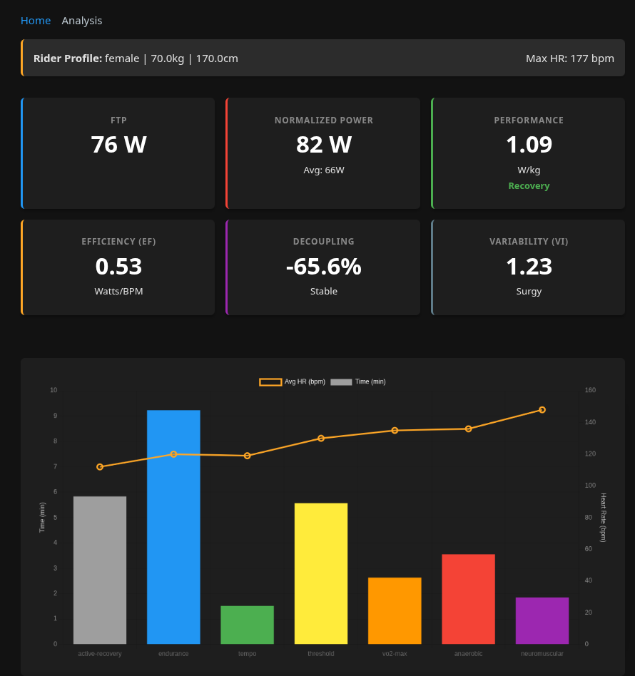

# Cycling Metrics App

A Clojure web application for analysing cycling activity data from `.fit` files. It provides **FTP estimation**, **Power-to-Weight Ratio (W/kg)** analysis, and personalized **Training Zones**.

## Features

- **FTP Estimation**: Estimates Functional Threshold Power (95% of 20-min max avg).
- **Running-to-Cycling FTP**: Estimates Cycling FTP from a running power file (approx. 80% of running power).
- **Training Zones**: Calculates 7 Power Zones (Coggan) and 5 Heart Rate Zones (Friel).
- **Max HR Estimation**: Estimates Max Heart Rate using the Tanaka formula (208 - 0.7 \* Age) if not provided.
- **Performance Metrics**: W/kg calculation and rider classification (Untrained to Elite).
- **Dual-Axis Visualization**: Interactive chart correlating Time-in-Zone with Average Heart Rate.
- **Inclusive Analysis**: Gender-inclusive classification standards (MTF/FTM/Non-Binary).
- **Data Parsing**: Extracts Power and Heart Rate from standard `.fit` files (Zwift, Garmin, etc.).

## Science & Models

- **FTP**: 95% of 20-min Power (Allen & Coggan).
- **Running FTP Conversion**: ~80% of Running Power (Rough estimate due to efficiency differences).
- **Max Heart Rate**: Tanaka Formula ($208 - 0.7 \times \text{Age}$).
- **Power Zones**: Coggan 7-Zone Model.
- **Heart Rate**: Friel Percentage of Max HR.
- **Classification**: Coggan Power Profile Tables (Gender-specific baselines).
  - _Note_: Transgender and Non-binary identities are mapped to either Male or Female physiological baselines for training metric purposes, based on current competitive guidelines (e.g., UCI 2023) and physiological data (Harper et al. 2021).

## Advanced Features for Injury Recovery

- **Efficiency Factor (EF)**: Measures Watts per BPM. Monitor this daily; an increase indicates your "aerobic engine" is getting more efficient.
- **Aerobic Decoupling (Pw:HR)**: Measures internal strain over time. A decoupling $>5\%$ suggests you are pushing beyond your current aerobic base—critical for returning from injury without overtraining.
- **Variability Index (VI)**: NP/AP ratio. Aim for $<1.05$ to ensure a steady, low-impact recovery ride.

## Preview



## Quick Start

1.  **Clone & Run**:
    ```bash
    git clone https://github.com/your-username/cycling-metrics.git
    cd cycling-metrics
    clojure -M:run
    ```
2.  **Use**: Open `http://localhost:8080`, upload a `.fit` file, and view insights.

## Technologies

Built with **Clojure**, **http-kit**, **Reitit**, **Hiccup**, **Garmin FIT SDK**, **Chart.js**, and **Pico.css**.

